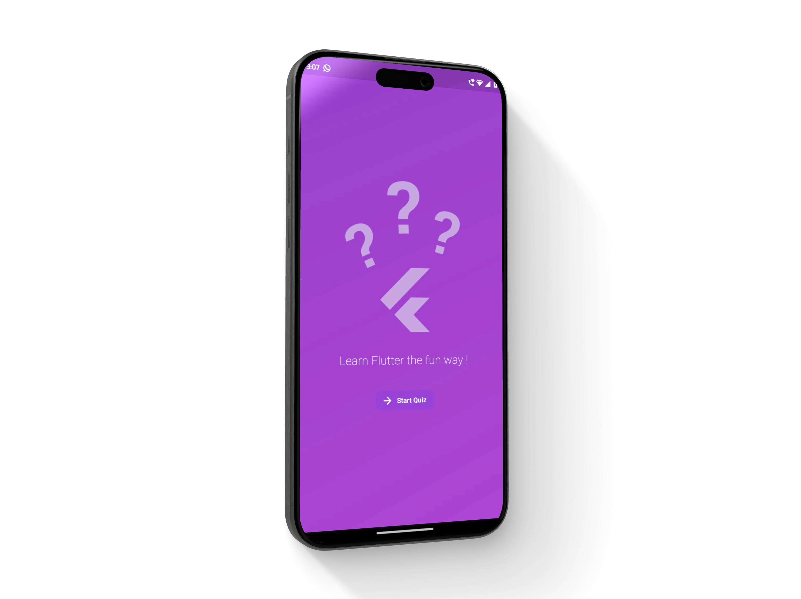
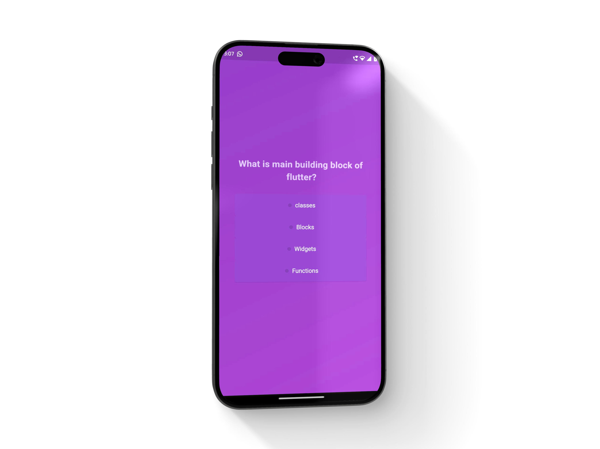
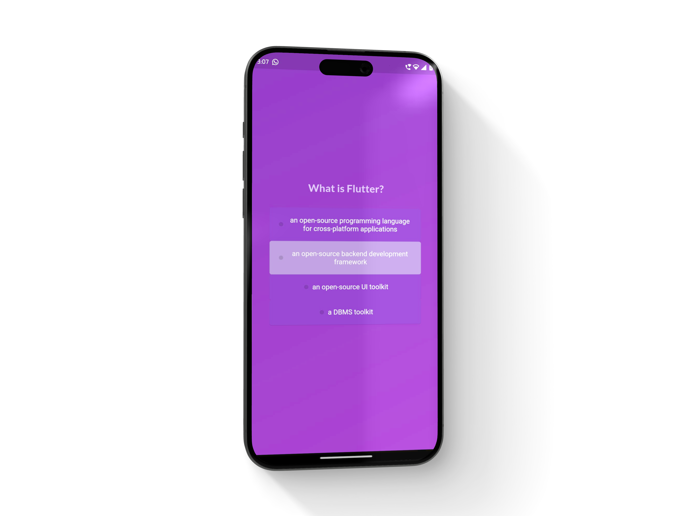
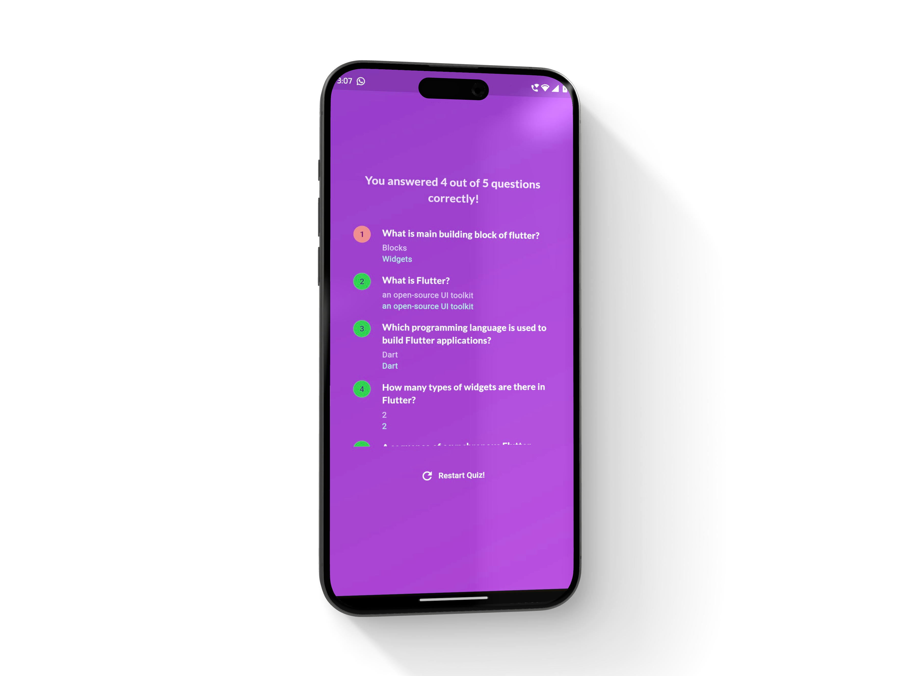

<!-- Gradient Heading -->
<!-- Gradient Heading -->
<h1 style="
  font-size: 2em; 
  background: -webkit-linear-gradient(to right, #ff7e5f, #feb47b); 
  -webkit-background-clip: text; 
  color: transparent;">
Flutter Quiz App
</h1>

<!-- Body Text -->
This is a Basic Flutter App, that displays a quiz and lets the user choose the answer, & shows the final screen with the number of correct answers. 

 It also allows the user to Restart the Quiz

<!-- Images -->

The motive of this App is to practise basic Flutter Widgets, especially if you are a beginner. 

